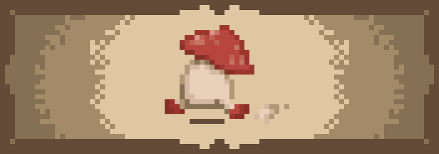

<p align="center">
  <a href="https://github.com/kittinan/spotify-github-profile">
    
  </a>
</p>


# My States

<!--START_SECTION:waka-->
**I'm a Night 🦉** 

```text
🌞 Morning                71 commits          █░░░░░░░░░░░░░░░░░░░░░░░░   03.93 % 
🌆 Daytime                428 commits         ██████░░░░░░░░░░░░░░░░░░░   23.67 % 
🌃 Evening                886 commits         ████████████░░░░░░░░░░░░░   49.00 % 
🌙 Night                  423 commits         ██████░░░░░░░░░░░░░░░░░░░   23.40 % 
```


**I Mostly Code in HTML** 

```text
HTML                     9 repos             ███████░░░░░░░░░░░░░░░░░░   28.12 % 
TypeScript               4 repos             ███░░░░░░░░░░░░░░░░░░░░░░   12.50 % 
Go                       2 repos             ██░░░░░░░░░░░░░░░░░░░░░░░   06.25 % 
C++                      2 repos             ██░░░░░░░░░░░░░░░░░░░░░░░   06.25 % 
Dart                     1 repo              █░░░░░░░░░░░░░░░░░░░░░░░░   03.12 % 
```


 Last Updated on 10/03/2026 02:02:44 UTC
<!--END_SECTION:waka-->

<p align="center"> 
  
</p>

